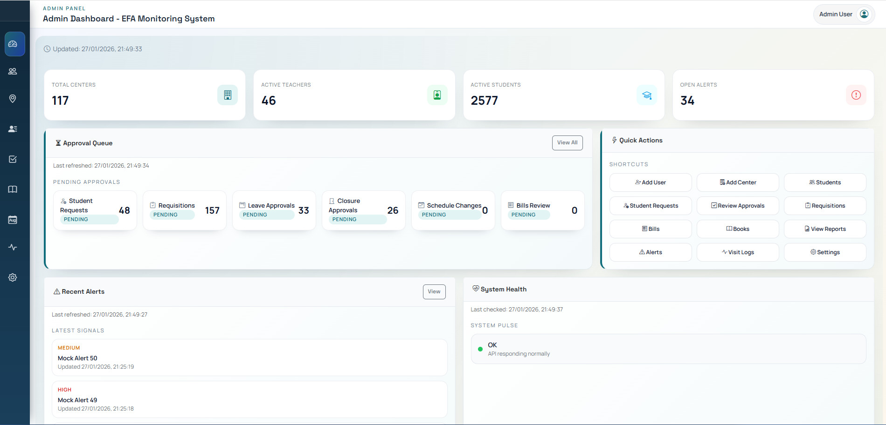
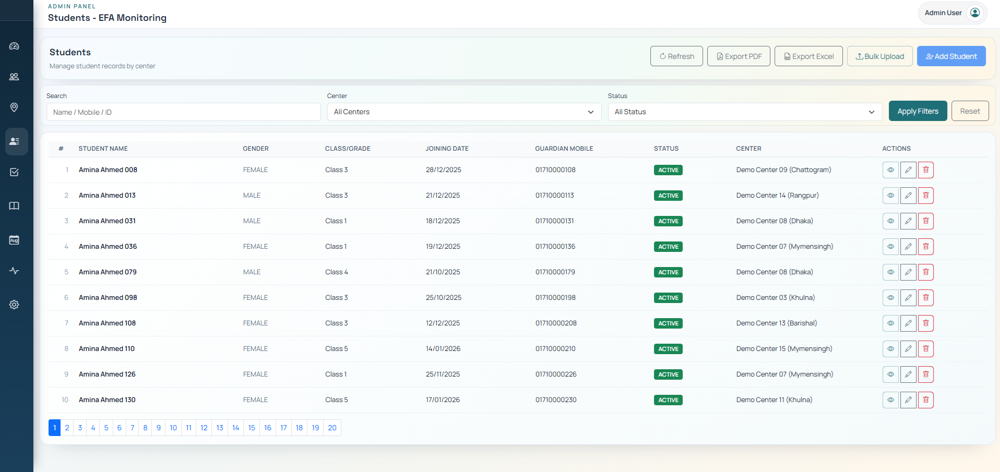
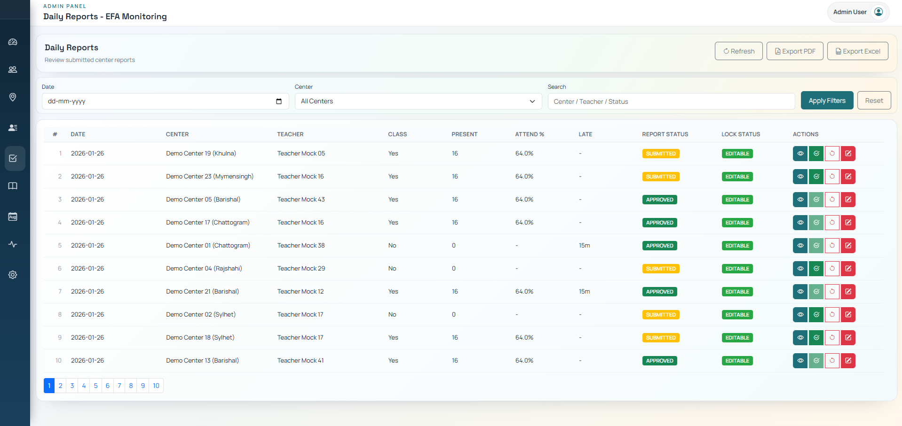

# EFA Monitoring System (Showcase)

🚀 **Production-ready Monitoring Platform for Education For All (EFA)**  
This repository is a **public showcase** of a real-world system designed to manage education centers, students, attendance, reporting, and monitoring workflows.

> ⚠️ This is a showcase repository only.  
> Source code and backend logic are proprietary and intentionally not included.

---

## 🌐 Live Website

👉 **Live Demo:** https://efanew.vercel.app/

⚠️ Access is **demo-only** and may be restricted.

---

## 🔑 Demo Access Credentials (Public Demo)

The following demo accounts are provided **strictly for evaluation and demonstration purposes**.

### 👤 Admin
- **Email:** admin@efa.org  
- **Password:** Admin123!

### 👤 Teacher
- **Email:** teacher@efa.org  
- **Password:** Teacher123!

### 👤 Monitor
- **Email:** monitor@efa.org  
- **Password:** Monitor123!

### 👤 CEO / Management
- **Email:** ceo@efa.org  
- **Password:** Ceo123!

### 👤 Staff
- **Email:** staff@efa.org  
- **Password:** Staff123!

⚠️ **Important Notes:**
- All accounts have **demo-level permissions**
- Data may reset periodically
- Do **NOT** upload real, sensitive, or personal data
- Abuse or misuse may result in demo access being disabled

---

## 📌 About This Repository

This repository is **NOT open-source**.

It exists only to:
- Showcase system features and workflows
- Demonstrate real-world usage
- Provide a live demo for evaluation
- Share screenshots and high-level architecture

🚫 Source code is **not included**  
🚫 Backend services are **private**  
🚫 Rebuilding or deploying is **not permitted**

---

## ✨ Key Features (High-Level)

- Role-based access control (Admin, Teacher, Monitor, Staff, Management)
- Daily class reporting with audit tracking
- Student enrollment and request workflows
- Attendance and performance monitoring
- Inventory and requisition management
- Automated alerts and system checks
- Secure authentication and authorization
- Scalable backend architecture

> Detailed implementation remains private for security and ownership reasons.

---

## 🖼️ Screenshots

> Screenshots are provided for demonstration purposes only.

### 🔐 Login

### 📊 Dashboard

### 👥 Students

### 🧾 Attendance

### 📑 Reports

---

## 🏗️ System Architecture (High-Level Overview)

- **Frontend:** Secure web interface
- **Backend:** Private API services
- **Database:** Secure and access-controlled
- **Storage:** Protected media storage
- **Authentication:** Token-based access

> Full system design and backend logic are intentionally private.

---

## 🔐 License & Usage

**Proprietary Software – All Rights Reserved**

This repository and the showcased system are the intellectual property of  
**Parikshit Gorain**.

❌ You may NOT:
- Copy or reproduce the source code
- Rebuild or redeploy the system
- Create derivative works
- Use commercially or non-commercially without permission

✅ You MAY:
- View the live demo
- Review screenshots
- Request authorized usage or collaboration

📩 **For licensing, collaboration, or authorized deployment:**  
Email: **parikshitgorain@yahoo.com**

---

## 👤 Ownership

**Owner & Maintainer:**  
**Parikshit Gorain**

Unauthorized copying, redistribution, or misuse is strictly prohibited.

## ❤️ Support the Work
This project is actively maintained and continuously improved.
Sponsorship supports development time, demo infrastructure, and documentation.

## 🤖 Building with AI
This system is built and improved using AI-assisted workflows, automation, and monitoring tools.
Development is ongoing.

