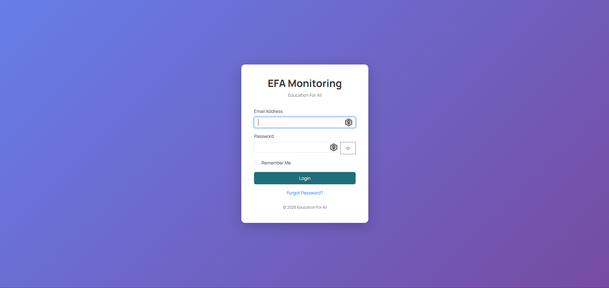
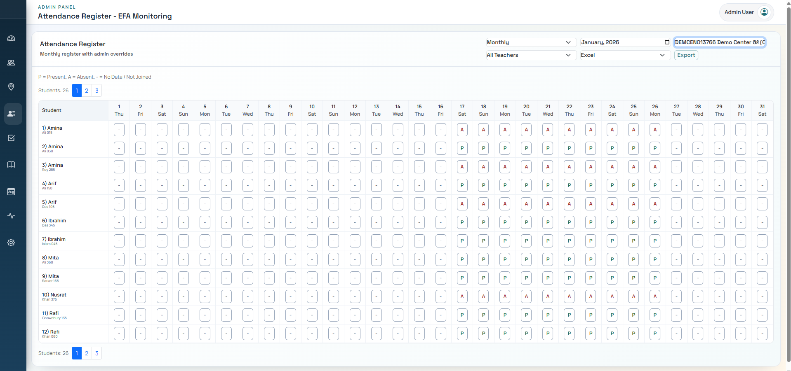

# EFA Monitoring System (Showcase)

🚀 **Production-ready Monitoring Platform for Education For All (EFA)**  
This repository is a **public showcase** of a real-world system used to manage education centers, students, attendance, and reporting.

---

## 🌐 Live Website

👉 **Live Demo:** https://efanew.vercel.app/  

> ⚠️ Access to the live system may be restricted or demo-only.

---

## 📌 About This Repository

This repository is **NOT open-source**.

It exists only to:
- Showcase system features
- Demonstrate architecture & workflows
- Provide a live demo link
- Share screenshots for evaluation

🚫 **Source code is NOT included**  
🚫 **Backend logic is NOT public**  
🚫 **Rebuilding or deploying is NOT allowed**

---

## ✨ Key Features (High-level)

- Role-based access control (Admin, Teacher, Monitor, Staff, Management)
- Daily class reporting with audit tracking
- Student enrollment & request workflows
- Attendance & performance monitoring
- Inventory & requisition management
- Automated alerts & system checks
- Secure authentication & authorization
- Scalable backend architecture

> Detailed implementation remains private for security and ownership reasons.

---

## 🖼️ Screenshots

> Screenshots are provided for demonstration purposes only.

### 🔐 Login

### 📊 Dashboard
![Dashboard]Screenshots/Dashboard.png)

### 👥 Students
![Students]Screenshots/Students.png)

### 🧾 Attendance

### 📑 Reports

---

## 🏗️ System Architecture (Overview)

- Frontend: Secure web interface
- Backend: Private API services
- Database: Secure & access-controlled
- Storage: Protected media storage
- Authentication: Token-based access

> Full architecture and backend logic are **intentionally private**.

---

## 🔐 License & Usage

**Proprietary Software – All Rights Reserved**

This repository and the showcased system are the intellectual property of **Parikshit Gorain**.

❌ You may NOT:
- Copy source code
- Rebuild the system
- Deploy similar implementations
- Use commercially or non-commercially

✅ You MAY:
- View the live demo
- Review screenshots
- Request authorized access

📩 **For licensing, collaboration, or authorized usage:**  
Email: **parikshitgorain@yahoo.com**

---

## 👤 Ownership

**Owner & Maintainer:**  
**Parikshit Gorain**

Unauthorized use, duplication, or redistribution is strictly prohibited.

